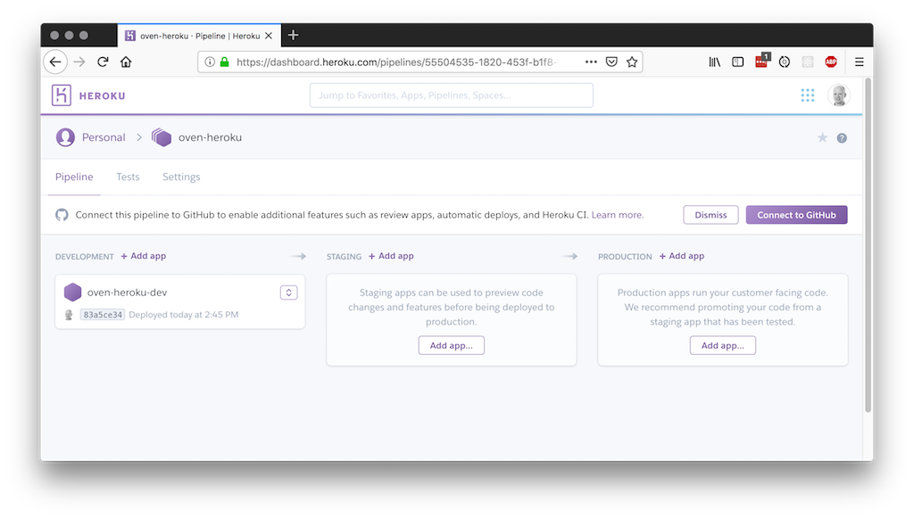
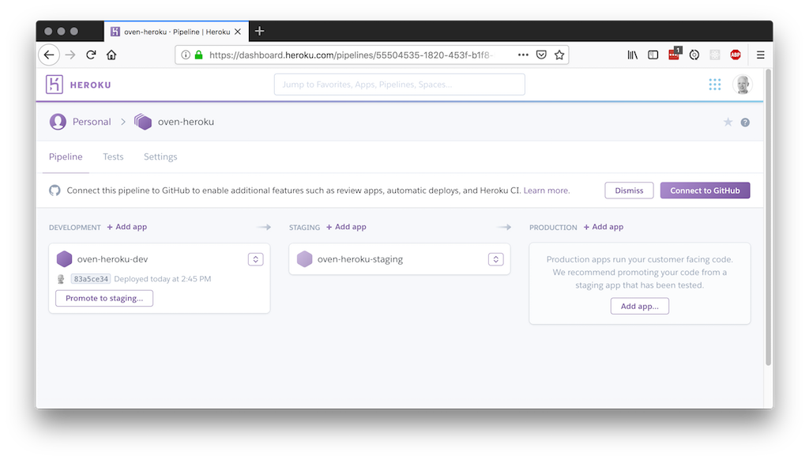

# Team workflow with GitHub and Heroku Pipelines

If you are on a team of a few people and you are working together on a product,
you will sooner or later need to integrate each team member's work with that
of the other team members. You will likely also have a customer who wants to
see progress and try out what you're making before releasing a new version to
the end-users. This likely means you'll need to keep several versions of your
project running at all times.

Different teams choose different strategies, but in
this workshop we will teach you a basic technique which is useful in most small
projects.

To get you started, we've set up a small project for you.

## Prerequisites

You need to create a user at GitHub

Before you start, you need to:
- [Sign up for GitHub](https://github.com/join)
- [Sign up for Heroku](https://signup.heroku.com)
- [Install git](https://git-scm.com/downloads)
- [Install Heroku CLI](https://devcenter.heroku.com/articles/heroku-cli)

If you run into problems pushing to github or heroku using https, you may also want to:
- [Add your SSH key to GitHub](https://help.github.com/articles/connecting-to-github-with-ssh)
- [Add your SSH key to Heroku](https://devcenter.heroku.com/articles/keys)

## Keep Heroku Dashboard open in a browser

It's useful to keep a browser pointed at
[the Heroku dashboard](https://dashboard.heroku.com) at all times during
the workshop. Most of the commands you execute in the terminal will
trigger an immediate response in the Heroku Dashboard, so you'll know
you're doing it right. If you're not particularly keen on writing lots
of commands, you can also do most of the things by using the Heroku
Dashboard user interface.

## About the command line examples

All the commands in this workshop are shown as they appear on a unix
console:

    $ echo Hello, World!
    Hello, World!

You're not supposed to write the `$` character - that's part of the prompt.
If you're on a Windows computer, you may be used to seeing it like this:

    C:\> echo Hello, World!
    Hello, World!

If we want you to replace part of the command with something else,
we'll enclose that in angle brackets like so:

    $ echo Hello, <username>!

and then you're supposed to write

    $ echo Hello, monty!

(if your username is monty). Don't include the brackets.

All good? Let's start!

## Fork and clone the repository from github
Go to https://github.com/kantega/heroku-demo and fork the repo into your personal account. 
Then, clone the repository from your fork: 

    $ git clone https://github.com/<username>/heroku-demo.git
    $ cd heroku-demo

## Create an app

Now you have the demo app git repository on your own computer. It's time
to launch it on your own personal Heroku cloud. After doing this, you'll
be able to open the app in your browser and see it running.

*Note* Heroku apps must have unique names, since they're available as
a URL on the Internet. To avoid naming conflicts, please add your
name to the name of the apps you create in this workshop.

*It is important that you are now in the `heroku-demo` directory*.
Change directory to `heroku-demo` if you have not already done so.

    $ heroku apps:create --region eu <username>-heroku-dev
    $ git push heroku
    
    Counting objects: 18, done.
    Delta compression using up to 8 threads.
    Compressing objects: 100% (18/18), done.
    Writing objects: 100% (18/18), 173.15 KiB | 6.41 MiB/s, done.
    Total 18 (delta 0), reused 0 (delta 0)
    remote: Compressing source files... done.
    remote: Building source:
    remote:
    remote: -----> Node.js app detected
    remote:
    remote: -----> Creating runtime environment

    ...
    
    remote: -----> Launching...
    remote:        Released v3
    remote:        https://<username>-heroku-dev.herokuapp.com/ deployed to Heroku
    remote:
    remote: Verifying deploy... done.
    To https://git.heroku.com/<username>-heroku-dev.git
     * [new branch]      master -> master

You should now see an app in the Heroku Dashboard. You may need to
refresh the page. Use the dashboard to open the app (there's a button
in the upper right corner that says "Open app"), and you should see a
spinning React logo.

## Create a pipeline

Now that you have an app, you can add it to a pipeline. A pipeline is where you
keep your development, staging and production apps. The app you just created
had a name that ended in `-dev`. That's because it's the app that we're going
to put in the development stage of your pipeline.

Let's create the development stage now:

    $ heroku pipelines:create --app <username>-heroku-dev --stage development <username>-heroku

You should see something like this:

    Creating oven-heroku pipeline... done
    Adding ⬢ oven-heroku-dev to oven-heroku pipeline as development... done

And the Heroku Dashboard should look something like this:

This command also added the `<username>-heroku-dev` app to the newly created stage.

## Create an app for the staging stage

To be able to keep a separate environment for development and testing purposes,
you'll need to create another app. This is often referred to as a "staging" app.
It's mainly used as a preview of what will be deployed to production.

Let's create the app, and add it to the pipeline:

    $ heroku apps:create --region eu <username>-heroku-staging
    $ heroku pipelines:add --app <username>-heroku-staging --stage staging <username>-heroku

And the Heroku Dashboard should look something like this:

## Promote the development app to staging

At the moment, there's nothing running on the staging app. You need to
deploy something. You've already created, compiled and run a development
version of your app. To copy that (without rebuilding), you can simply
promote the app from the development stage to the staging stage.

    $ heroku pipelines:promote --app <username>-heroku-dev

Visit https://username-heroku-staging.herokuapp.com/ to see your staging app
(or open it from the Heroku Dashboard)

## Edit a file and push to development
    
Make a small change to `src/App.js`. You can use any editor you like. I use vim.

    $ vim src/App.js

Then commit and push to heroku. You are now pushing to the development version, since heroku apps:create
created the heroku remote for you, and subsequent calls to heroku apps:create does not overwrite that. 

    $ git add .
    $ git commit -m "ove was here"
    $ git push heroku

Then, reload https://username-heroku-dev.herokuapp.com/ - You should be able to see your changes.
Also, reload https://username-heroku-staging.herokuapp.com/ and observe that the changes are not there.

## Promote the development app to staging again

You've now completed development of your new feature, and you'd like to share it
with your customer. To do this, you promote the app again, like you did before.

    $ heroku pipelines:promote --app <username>-heroku-dev

## Exercise: Production

Create a production app, connect it to the pipeline and promote staging to production. 

## Connect to github

Bring up the Heroku console, and observe the following banner on top: 

"Connect this pipeline to GitHub to enable additional features such as review apps, 
automatic deploys, and Heroku CI"

Click "Connect to GitHub" to do just that. Enter heroku as the name of the repository to connect
to, and return to the pipeline view. 

## Enable automatic deployment

It is considered a best practice to always keep the master branch deployed
to the development environment. To set it up so that Heroku automatically deploys master to the development
stage, go to the Heroku Dashboard, click the arrow next to "<username>-heroku-dev" and select "Configure automatic deploys...". Choose
the master branch, and click "Enable Automatic Deploys". 

Now, make a small change to `src/App.js`, save and push to github. After a few seconds. you should see
"Building app" in the Heroku console. 

## Enable Review Apps

Heroku can automatically deploy any pull requests you make on github. This enables anyone who is reviewing
your pull request to see the changes in action. In the Heroku console, click "Enable Review Apps...". 

Heroku will ask you for a parent app to copy settings from. Select "<username>-heroku-dev" and click
"Create an app.json file". You can review the settings it proposes, and select "Commit to repo". Then, 
select "<username>-heroku-dev" as the app to inherit config vars from, and finally 
check the box next to "Create new review apps for new pull requests automatically". Click "Enable" to 
save your changes. 

You should now see a message saying "There are no open pull requests on <username>/heroku". 

## Create a pull request

Since you committed a new `app.json` file in the previous step, you need to pull that commit before
carrying on. 

    $ git pull 

Then, create a branch with some changes

    $ git checkout -b my-pr-1
    $ vim src/App.js ## make some changes
    $ git commit -a -m "I made some changes"
    $ git push -u origin my-pr-1

Now you can create a pull request from your branch.
*Note* Make sure you select your own master branch as the base, otherwise the pull request will be made
against the repository you forked from, and that repository is not connected to your Heroku.

Visit this URL to create the pull request:
https://github.com/username/heroku-demo/pull/new/my-pr-1

Again, make sure you select *your own master branch* as the base, not Kantega.

Then, head back to the heroku console, where you should find that Heroku is already busy building
and deploying an app for your pull request. 

## Inspect and review the pull request

Now you're ready to do a proper code review. Look to the person sitting next to you, and go through
the pull request on GitHub together. Demonstrate the changes by pulling up your review app in the
browser, and show how the running review app differs from the running development version.

## Merge pull request
When you've done the code review, head on over to github and approve and merge the pull request. Heroku will immediately remove the
review app. Since you also configured automatic deployments to development, you will also see a progress 
indicator next to "Building app" in the development stage. 

When this is done, you can refresh the development app, and you should see that your changes have been published. 

Happy hacking!

